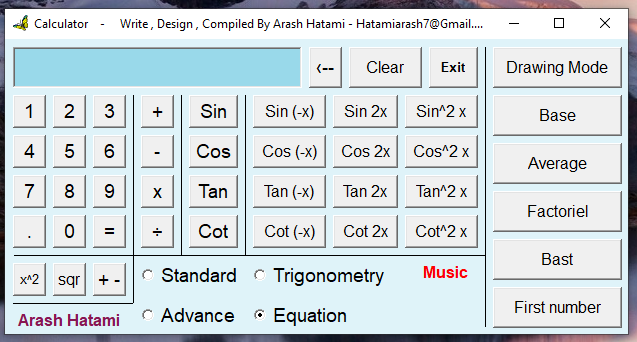

# Calculator

My first published project ... 12 years ago :)))

A 13-year-old boy's project. Calculator with music 😄

Visual Basic 6

## Compile

1- Put some musics in `Sound` folder :

    root
    ├── Sound
    │   └── Main_1.wav
    │   └── Main_2.wav
    │   └── Main_3.wav
    │   └── Main_4.wav
    │   └── Main_5.wav

2- Open VisualBasic and compile :)
